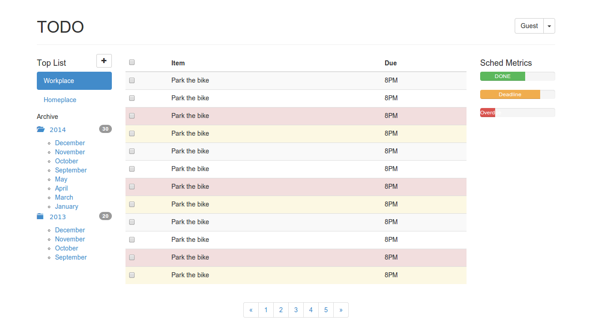
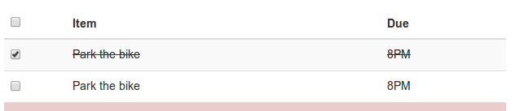
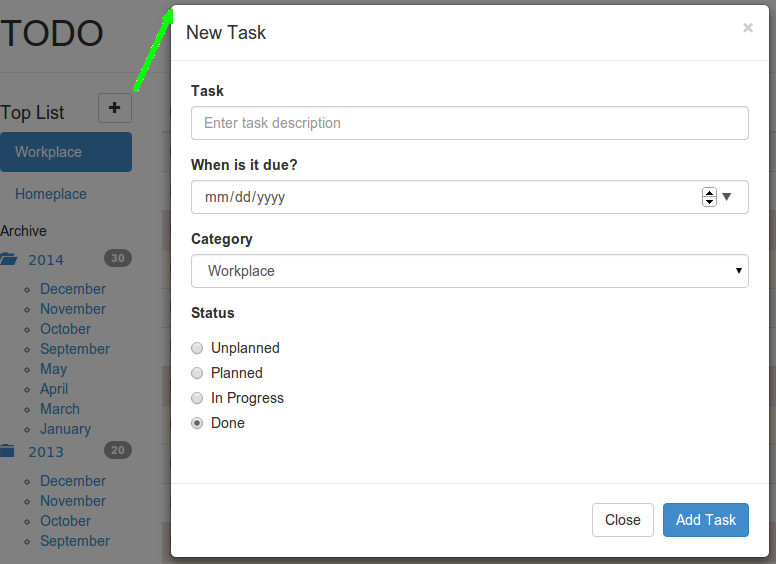
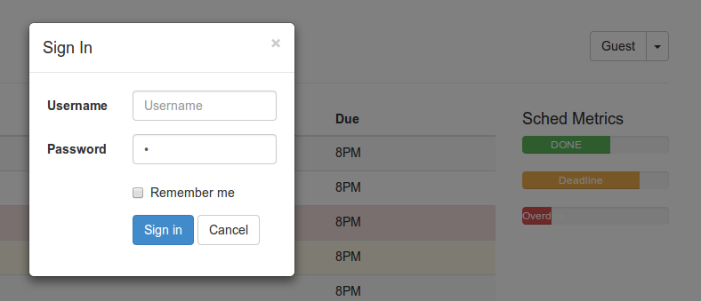
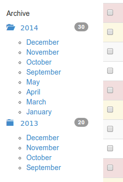

TO-DO Specifications
====
## Objectives ##
- To capture the scope of Project TO-DO
- To have an overview design for Project TO-DO
- To estimate the risks
- To foresee business opportunities

## Content ##
TO-DO is a distributed system consisted of two major components:

- Server component deployed on cloud platform
- Client component which runs inside HTTP browsers

This document describes the behavior of the system as a whole unless otherwise noted.

###Versions

Latest: 0.1.1

###General Requirements

####Internationalization/Localization
- Content must be translated into English/Vietnamese/Japanese
- Date and time notation
- Currency must be localized

###Functional Requirements

####List active to-do items in order of increasing due date

**Pre-conditions**

- At least one filter (category) is selected
- At least one to-do item exists in the database

**Post-conditions**

- Listed items must be filtered according to nav-item selected on the sidebar

####Update status of listed items using the checkbox

If the checkbox is unchecked, the to-do item is not done. When the user checks, the item status is updated to become "done".

**Pre-conditions**

- At least one item is visible on the list
- To-do item must not be in the 'done' status, but must be in one of the following statuses:
	+ 'unplanned'
	+ 'planned'
	+ 'in-progress'

**Post-conditions**

- Tasks due today and later must always be visible regardless of its status
- Overdue tasks which are done must not be visible
- Archive must be updated
- Sched health must be updated

####Add new task

When user clicks on the plus button, a modal dialog must appear for user to put in new task information. New task won't be recorded until user clicks button "Add Task". User may cancel the operation with the button "Cancel"

**Pre-condition**

- Add new task dialog must be open
- Task required fields must be filled

**Post-conditions**

- Add new task dialog must be closed
- Task list must be updated if the newly added task is due today or later.
- Task list items must retain the correct order of increasing due date
- Archive must be updated if the newly added task is done and due in the past

####Sign In

User must enter username and password in order to sign in the system. User can hit enter or click button Sign In to sign into the system. User can hit button "Cancel" to close the dialog.

**Pre-conditions**

- All required fields are present
- At least one user exists in the database
- User is a guest

**Post-conditions**

- Sign-in dialog must be closed
- User is logged in: A cookie is created to keep track of user
- Username and Gravatar are displayed in place of "Guest"
- If user chooses "Remember me", a cookie is created to store this option

####Keep Sched Metrics updated

The Sched Metrics must be kept updated at all times. To-DO items are classified into three groups:

- DONE: Any done tasks are classified into this group (whether they are overdue or on time)
- Deadline: Tasks whose deadlines are coming within the next 7 days. These tasks are not done.
- Overdue: Undone tasks whose deadlines are already in the past.

The three bars are shown at all times. These bars reflect percentage values according to the following formula:

	percentage = the number of items in group / the total tasks in the system

**Pre-conditions**

- At least one To-Do item exists

**Post-conditions**

- The number of items in DONE must be less than or equal to the total items
- The number of items in the Deadline must be less than or equal to the total items
- The number of items in the Overdue must be less than or equal to the total items

####Hide Sched Metrics when there is no tasks in the system

**Pre-conditions**

- No To-Do item exists

**Post-conditions**

- Sched Metrics must be hidden from view

####Keep TO-DO Archive updated

The archive reflects the number of To-Do items at all times.

- When a To-Do item is inserted or updated:

	- If the item's year is not present, a new year must be created
	- If the item's month is not present, a new month must be created

- When a To-DO item is removed:
	
	- If the item is the last one of that month, that month must be removed
	- If the month is the last one of that year, that year must be removed

####Hide TO-DO Archive

When there is no item in the archive, TO-DO Archive must be hidden from view. User cannot access it by any means.

**Pre-conditions**

- No To-Do item exists

**Post-conditions**

- TO-DO Archive must be hidden from view
